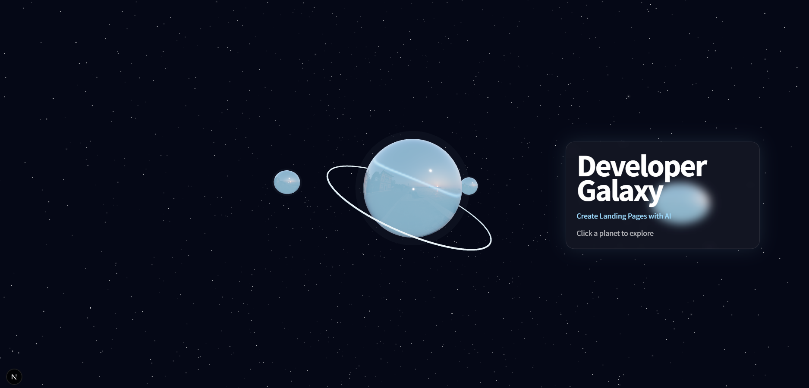

# 🌌 Developer Galaxy

Three.js × React Three Fiberで制作した
インタラクティブなポートフォリオサイト。

惑星をクリックして作品を探索できる
宇宙テーマのWebポートフォリオです。

## 🚀 Live Demo

https://three-practice-sigma.vercel.app

---

## ✨ Features

- 🪐 Planet Navigation
- 🎯 Camera Focus Animation
- 💼 Project Showcase
- 📱 Responsive Design
- ✨ Floating Planet Animation
- 🌠 Starfield Background
- 🎨 Glassmorphism UI

---

## 🛠 Tech Stack

- Next.js
- React
- TypeScript
- Three.js
- React Three Fiber
- Drei
- Tailwind CSS

---

## 📸 Screenshot

---

## 📚 Learning Goals

- Three.js
- WebGL
- Interactive UI
- Shader Effects
- Modern Frontend Development

---

## 👨‍💻 Author

nozojj

Frontend Developerを目指して学習中。
React / Next.js / Three.js を中心に
AI SaaSやインタラクティブなWeb制作に挑戦しています。
